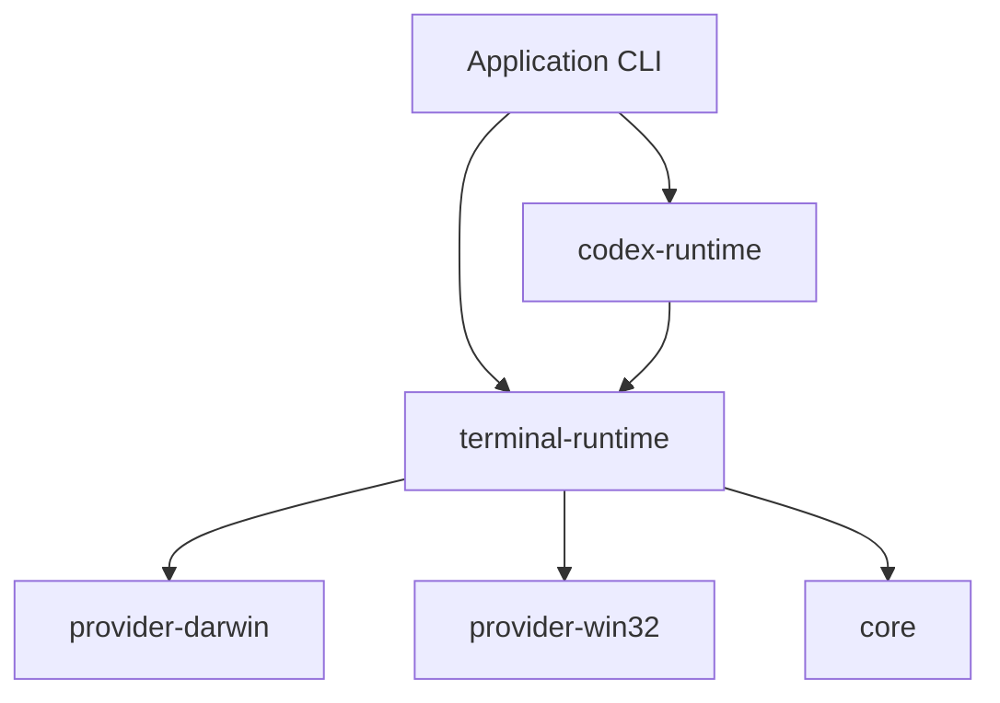

# metacli

Reusable runtime and provider toolkit for building AI-native CLIs that need stable machine contracts and terminal-backed automation.

[中文说明](./README.zh-CN.md)

## What It Solves

When an AI CLI grows past a single script, three problems show up fast:

| Problem | Typical failure mode | metacli approach |
| --- | --- | --- |
| CLI contract drifts | Humans can use it, agents cannot rely on it | `core` provides JSON/error/spec/doctor helpers |
| Terminal automation gets duplicated | Every app copies AppleScript / PowerShell edge cases | `provider-*` modules centralize platform primitives |
| App logic and environment control get mixed together | Product workflow becomes coupled to terminal semantics | `terminal-runtime` and `codex-runtime` separate runtime from business logic |

## Architecture



## Module Layout

| Source module | Purpose | Import path |
| --- | --- | --- |
| `src/core` | JSON helpers, error model, CLI spec and doctor helpers | `@duo121/metacli/core` |
| `src/terminal-runtime` | Provider registry, snapshots, target resolution, runtime orchestration | `@duo121/metacli/terminal-runtime` |
| `src/provider-darwin` | Apple Terminal and iTerm2 automation | `@duo121/metacli/provider-darwin` |
| `src/provider-win32` | Windows Terminal and Command Prompt automation | `@duo121/metacli/provider-win32` |
| `src/codex-runtime` | Codex session attach / launch / prompt / capture helpers | `@duo121/metacli/codex-runtime` |
| `src/create-metacli` | Starter manifest today, scaffold entrypoint later | `@duo121/metacli/create-metacli` |

`metacli` is published as one npm package. These are internal source modules exposed through subpath exports, not separately published packages.

## Why `terminal-runtime` Exists

`@duo121/metacli/terminal-runtime` is the middle layer between low-level providers and application code.

| Layer | Responsibility | Why it should stay separate |
| --- | --- | --- |
| `core` | JSON, errors, spec, doctor helpers | No terminal semantics |
| `provider-darwin` / `provider-win32` | Platform-specific automation primitives | Should stay close to AppleScript / PowerShell details |
| `terminal-runtime` | Unified session model, provider registry, snapshot merge, target resolution, capability checks, open/send/focus/press orchestration | Prevents every app from reassembling providers and duplicating runtime logic |
| `codex-runtime` | Codex-specific session workflows | Higher-level than raw terminal control |
| application | product behavior | Should not know platform edge cases |

If `terminal-runtime` did not exist, every app would need to:

- choose the right provider for the current platform
- merge provider snapshots into one stable model
- resolve one exact target from selectors
- check provider capabilities before mutating
- orchestrate open/send/focus/press/capture across providers

That is reusable runtime logic, not app logic, and not provider-specific logic either. That is why it is its own exported runtime module inside the package.

## Capability Matrix

| Capability | Darwin provider | Win32 provider | Notes |
| --- | --- | --- | --- |
| Snapshot/list | Yes | Yes | Unified session/window/tab model |
| Resolve target | Yes | Yes | Exact and current-session oriented |
| Send text | Yes | Yes | TTY/native send on macOS, UI automation on Windows |
| Press keys | Yes | Yes | `enter` and `return` currently normalized |
| Capture visible output | Yes | Yes | Native on macOS, best-effort visible text on Windows |
| Focus session | Yes | Yes | Provider-specific automation |
| Open new window/tab | Yes | Partial | Windows open is not shipped yet |
| Close target | Yes | Yes | Tab on Terminal/iTerm2 and Windows Terminal, window on `cmd` |

## Recommended Layering


| Put it in `metacli` | Keep it in the app |
| --- | --- |
| Terminal snapshot/resolve/open/send/focus/press/capture | Business commands |
| Codex session attach/launch/submit/capture | Domain routing and persistence |
| JSON CLI contract helpers | Prompt policy |
| Doctor and runtime capability reporting | Product-specific workflows |

## Install

```bash
npm install @duo121/metacli
```

## Quick Start

```bash
node -e "import('@duo121/metacli/provider-darwin').then(console.log)"
```

```js
import { createDarwinTerminalRuntime } from "@duo121/metacli/provider-darwin";

const runtime = createDarwinTerminalRuntime();
const target = await runtime.resolveTarget({
  currentWindow: true,
  currentTab: true,
  currentSession: true,
});

await runtime.sendText(target, "codex", { newline: true });
```

## Validation

| Command | Purpose |
| --- | --- |
| `npm test` | Run integration coverage for exports, runtime, codex helpers, and starter manifest |
| `npm run pack:check` | Run `npm pack --dry-run` for the single publishable package |

## Docs

| Doc | Purpose |
| --- | --- |
| [`docs/architecture.md`](./docs/architecture.md) | Package boundaries and ownership |
| [`docs/module-map.md`](./docs/module-map.md) | How legacy terminal concerns map into `metacli` modules |
| [`docs/integration-guide.md`](./docs/integration-guide.md) | How to consume `metacli` from an application CLI |
