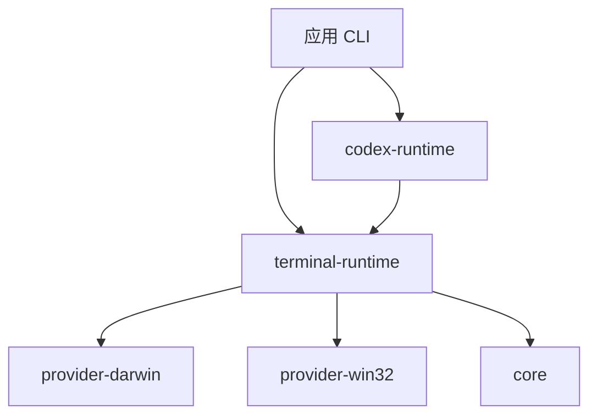

# metacli

面向 AI-native CLI 的可复用运行时与 provider 工具集，重点解决“稳定机器契约”和“终端自动化底座复用”这两件事。

[English README](./README.md)

## 它解决什么问题

当一个 AI CLI 从单脚本演进成真实产品后，通常会同时踩到三类坑：

| 问题 | 常见失效方式 | metacli 的处理方式 |
| --- | --- | --- |
| CLI 契约不稳定 | 人能用，智能体不能可靠调用 | `core` 统一 JSON / error / spec / doctor |
| 终端自动化被重复实现 | 每个项目都复制 AppleScript / PowerShell 边角逻辑 | `provider-*` 模块集中维护平台能力 |
| 业务流程和环境控制混在一起 | 产品语义绑死在 terminal 细节上 | `terminal-runtime` / `codex-runtime` 明确分层 |

## 架构图



## 模块结构

| 源码模块 | 作用 | 导入路径 |
| --- | --- | --- |
| `src/core` | JSON 辅助、错误模型、CLI spec/doctor helper | `@duo121/metacli/core` |
| `src/terminal-runtime` | provider 注册、snapshot、target resolve、运行时编排 | `@duo121/metacli/terminal-runtime` |
| `src/provider-darwin` | Apple Terminal / iTerm2 自动化 | `@duo121/metacli/provider-darwin` |
| `src/provider-win32` | Windows Terminal / Command Prompt 自动化 | `@duo121/metacli/provider-win32` |
| `src/codex-runtime` | Codex 会话 attach / launch / prompt / capture | `@duo121/metacli/codex-runtime` |
| `src/create-metacli` | 当前提供 starter manifest，后续可扩成脚手架 | `@duo121/metacli/create-metacli` |

`metacli` 只发布一个 npm 包。上面这些是包内源码模块，通过 subpath exports 暴露，不是独立发布的子包。

## 为什么要有 `terminal-runtime`

`@duo121/metacli/terminal-runtime` 不是“多出来的一层产品包”，而是夹在 provider 和应用之间的运行时层。

| 层 | 职责 | 为什么要独立出来 |
| --- | --- | --- |
| `core` | JSON、错误模型、spec、doctor helper | 不应该带 terminal 语义 |
| `provider-darwin` / `provider-win32` | 平台相关自动化 primitive | 应该贴近 AppleScript / PowerShell 细节 |
| `terminal-runtime` | 统一 session 模型、provider registry、snapshot merge、target resolve、capability check、open/send/focus/press 编排 | 避免每个应用都自己拼装 provider 和重复运行时逻辑 |
| `codex-runtime` | Codex 会话级流程 | 比原始 terminal control 更高一层 |
| 应用层 | 产品行为 | 不应该知道平台边角细节 |

如果没有 `terminal-runtime`，每个应用都得自己重复做这些事：

- 根据当前平台挑 provider
- 把多个 provider 的 snapshot 合成统一模型
- 从 selectors 里 resolve 出唯一 target
- 在 mutating action 前检查 capability
- 在不同 provider 之间统一 open/send/focus/press/capture 的调用方式

这部分明显是可复用运行时，不属于业务层，也不属于单个 provider，所以单独作为包内导出模块是合理的。

## 能力矩阵

| 能力 | Darwin | Win32 | 备注 |
| --- | --- | --- | --- |
| snapshot / list | 支持 | 支持 | 统一输出 window/tab/session 模型 |
| resolve target | 支持 | 支持 | 适合 AI 做精确定位 |
| send text | 支持 | 支持 | macOS 侧可走 tty/native，Windows 侧走 UI Automation |
| press keys | 支持 | 支持 | 当前统一 `enter` / `return` |
| capture visible output | 支持 | 支持 | macOS 原生抓取，Windows 尽力抓取可见文本 |
| focus session | 支持 | 支持 | provider 内部处理 |
| open new window/tab | 支持 | 部分支持 | Windows 新开窗口/标签仍待补完 |
| close target | 支持 | 支持 | `cmd` 为窗口级关闭 |

## 推荐分层


| 放进 `metacli` | 留在应用里 |
| --- | --- |
| terminal snapshot / resolve / open / send / focus / press / capture | 业务命令树 |
| Codex session attach / launch / submit / capture | 领域状态和路由 |
| JSON CLI contract helper | prompt 策略 |
| doctor 与 capability 报告 | 产品工作流 |

## 安装

```bash
npm install @duo121/metacli
```

## 快速开始

```bash
node -e "import('@duo121/metacli/provider-darwin').then(console.log)"
```

```js
import { createDarwinTerminalRuntime } from "@duo121/metacli/provider-darwin";

const runtime = createDarwinTerminalRuntime();
const target = await runtime.resolveTarget({
  currentWindow: true,
  currentTab: true,
  currentSession: true,
});

await runtime.sendText(target, "codex", { newline: true });
```

## 校验命令

| 命令 | 用途 |
| --- | --- |
| `npm test` | 运行导出、runtime、codex helper、starter manifest 的集成测试 |
| `npm run pack:check` | 对单一发布包执行 `npm pack --dry-run` |

## 文档

| 文档 | 作用 |
| --- | --- |
| [`docs/architecture.md`](./docs/architecture.md) | 包边界与职责划分 |
| [`docs/module-map.md`](./docs/module-map.md) | 传统终端能力如何映射到 `metacli` 模块 |
| [`docs/integration-guide.md`](./docs/integration-guide.md) | 应用 CLI 如何接入 `metacli` |
